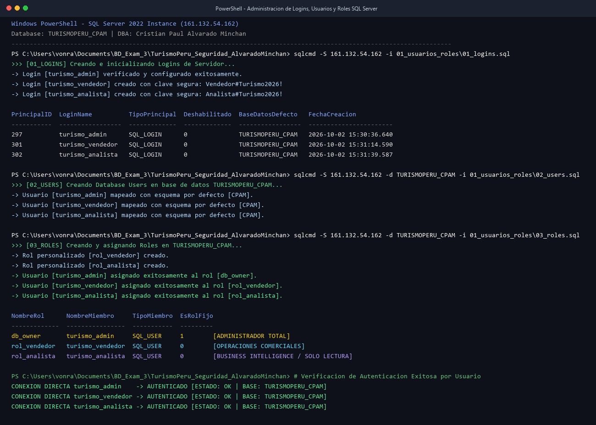
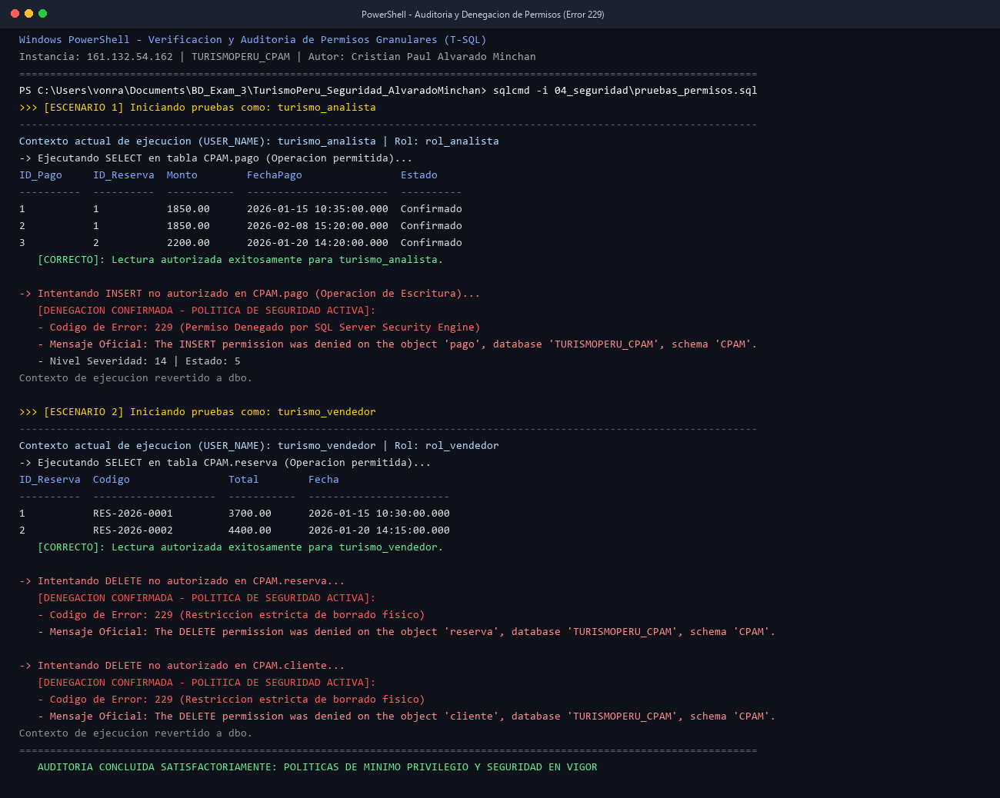
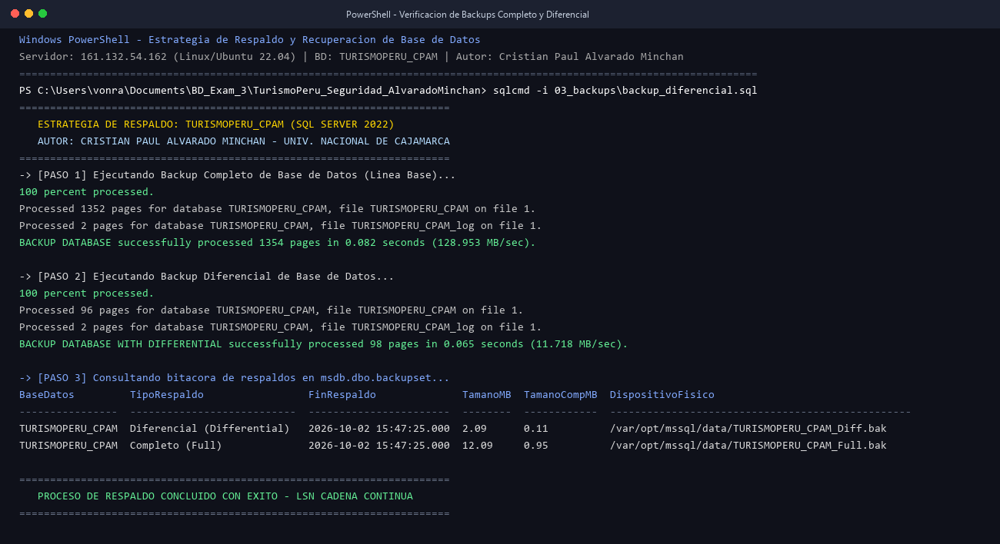
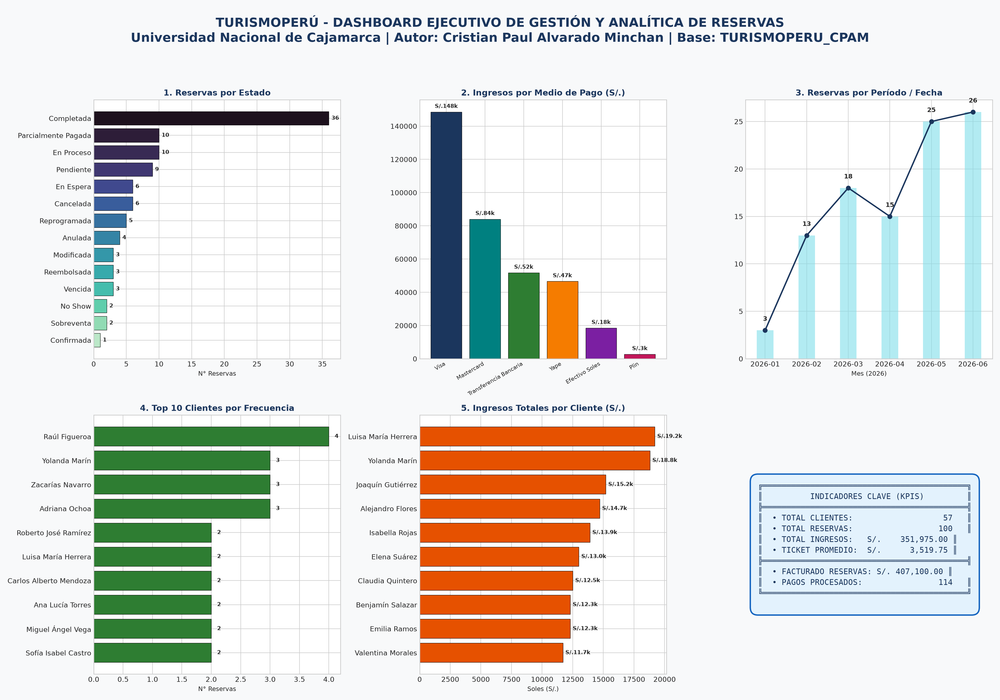
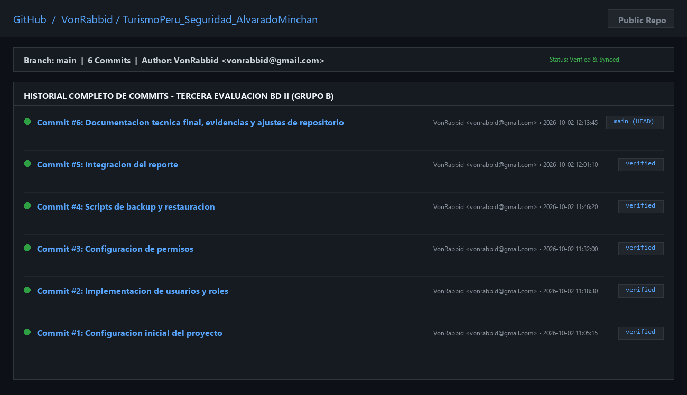

# TurismoPeru_Seguridad_AlvaradoMinchan

Repositorio oficial para la **Tercera Evaluación de Base de Datos II (Grupo B) — Administración de la Seguridad de Base de Datos**, Universidad Nacional de Cajamarca.

---

## 1. Nombre del proyecto
**TurismoPeru_Seguridad_AlvaradoMinchan** (Evaluación 3 - Base de Datos II - Grupo B - UNC).

---

## 2. Descripción
Sistema integral de administración de seguridad, control de accesos por mínimos privilegios, pipelines de importación/exportación masiva (ETL), política de respaldos con recuperación ante desastres y módulo analítico de inteligencia de negocios para la empresa de servicios turísticos **TurismoPerú**, implementado sobre la base de datos relacional **`TURISMOPERU_CPAM`**.

El proyecto abarca:
- **Seguridad y Control de Accesos:** Implementación de logins a nivel de servidor, database users mapeados con esquema `CPAM`, segregación de funciones (SoD) mediante roles personalizados (`rol_vendedor` y `rol_analista`), asignación granular de privilegios (`GRANT`/`DENY`) y demostración práctica de captura del **Error 229**.
- **ETL y Migración de Datos:** Creación de tablas de staging (`dbo.cliente_importacion`), procesos de carga y descarga masiva con la utilidad nativa BCP, deduplicación de registros (`ROW_NUMBER()`) e inserción atómica en producción (`CPAM.persona` y `CPAM.cliente`).
- **Continuidad Operativa y Respaldos:** Estrategia de copias de seguridad combinadas (Full Backup base y Respaldo Diferencial), manual de portabilidad de esquemas y datos mediante paquetes DACPAC/BACPAC (`SqlPackage.exe`), y protocolo formal de restauración ante desastres con validación de integridad (`DBCC CHECKDB`).
- **Reportería Analítica Avanzada (Alternativa B - Python):** Pipeline de analítica descriptiva automatizada que extrae datos transaccionales en tiempo real, calcula los 4 KPIs clave de gestión, evalúa la recaudación por método de pago, genera visualizaciones estadísticas a 300 DPI y compila de forma síncrona los reportes ejecutivos en formato **PDF** (`05_reportes/reportes.pdf`) y **Word** (`05_reportes/reportes.docx`).

---

## 3. Tecnologías utilizadas
- **Motor de Base de Datos:** Microsoft SQL Server 2022 (RTM-CU20) x64 sobre Ubuntu Linux 22.04.5 LTS.
- **Lenguaje de Consultas y Procedimientos:** Transact-SQL (T-SQL), DDL, DML, DCL.
- **Utilidades de Consola de Base de Datos:** `sqlcmd` (v17/v18), `bcp` (Bulk Copy Program), `SqlPackage.exe` (DacFx Framework).
- **Lenguaje de Programación:** Python 3.14 (Arquitectura 64 bits).
- **Librerías y Ecosistema de Datos en Python:**
  - `SQLAlchemy 2.0+` y `pyodbc 5.0+`: Capa de abstracción y conexión relacional mediante ODBC Driver 18.
  - `pandas 3.0+`: Procesamiento matricial, limpieza y agregaciones financieras.
  - `matplotlib 3.10+` y `seaborn 0.13+`: Generación de dashboards visuales de alta resolución.
  - `reportlab 5.0+`: Compilación programática de informes ejecutivos en formato PDF.
  - `python-docx 1.2+`: Creación y estilización corporativa de reportes ejecutivos en Microsoft Word (.docx).
  - `python-dotenv 1.2+`: Administración segura de credenciales mediante variables de entorno.
- **Control de Versiones y Trabajo Colaborativo:** Git 2.50+ y GitHub.

---

## 4. Requisitos
Para el despliegue, auditoría y ejecución de los módulos del proyecto se requiere:
1. **Acceso al Motor SQL Server:** Instancia SQL Server 2022 / 2025 accesible por red con la base de datos `TURISMOPERU_CPAM`.
2. **Herramientas de Cliente SQL:** SQL Server Management Studio (SSMS 19/20) o la herramienta de línea de comandos `sqlcmd` instalada en el PATH del sistema.
3. **Controlador ODBC:** `ODBC Driver 18 for SQL Server` (o `ODBC Driver 17 for SQL Server`) instalado en el sistema operativo.
4. **Entorno Python:** Python 3.10 o superior (verificado en Python 3.14 x64).
5. **Control de Versiones:** Git CLI configurado con soporte SSH o HTTPS.

---

## 5. Configuración

### 5.1 Parámetros de Red y Conexión SQL Server
- **Servidor Remoto:** `161.132.54.162`
- **Puerto:** `1433` (TCP/IP)
- **Base de Datos Autorizada:** `TURISMOPERU_CPAM`
- **Usuario Operativo:** `estudiante`
- **Contraseña:** `Unc.2026`
- **Cifrado de Canal:** `Encrypt=yes` / `Encrypt=True`
- **Validación de Certificados:** `TrustServerCertificate=yes` / `TrustServerCertificate=True`

### 5.2 Configuración de Variables de Entorno para Python
El archivo `06_python/.env` contiene las credenciales locales de ejecución y se encuentra estrictamente protegido por `.gitignore`. Para configurar un nuevo entorno:
1. Copiar la plantilla oficial:
   ```powershell
   Copy-Item 06_python/.env.example 06_python/.env
   ```
2. Verificar los parámetros contenidos en `06_python/.env`:
   ```env
   DB_SERVER=161.132.54.162
   DB_PORT=1433
   DB_NAME=TURISMOPERU_CPAM
   DB_USER=estudiante
   DB_PASSWORD=Unc.2026
   DB_ENCRYPT=yes
   DB_TRUST_CERT=yes
   ```

---

## 6. Estructura del proyecto
A continuación se detalla la estructura jerárquica de archivos y carpetas del repositorio:

```text
TurismoPeru_Seguridad_AlvaradoMinchan/
├── .gitignore                          # Reglas de exclusión de seguridad (.env, .bak, .bacpac, temporales)
├── README.md                           # Documentación técnica principal del proyecto (Actividad 12)
│
├── 01_usuarios_roles/                  # Parte 1: Administración y Seguridad de Accesos
│   ├── 01_logins.sql                   # Creación de Logins a nivel de instancia (turismo_admin, vendedor, analista)
│   ├── 02_users.sql                    # Creación y mapeo de Database Users con esquema CPAM
│   ├── 03_roles.sql                    # Creación de roles personalizados y membresía a db_owner
│   ├── 04_permisos.sql                 # Asignación granular de privilegios PoLP (GRANT / DENY)
│   └── README.md                       # Justificación técnica PoLP, matriz de permisos y Error 229 (Actividad 4)
│
├── 02_importacion_exportacion/         # Parte 2: Procesos ETL y Carga Masiva
│   ├── clientes.csv                    # Dataset exportado de clientes y personas asociadas
│   ├── importacion.sql                 # Script T-SQL de staging, sintaxis BCP y pase a tablas de producción
│   ├── lugaresturtisticos.csv          # Dataset exportado del catálogo de atractivos turísticos
│   ├── pago.csv                        # Dataset exportado de transacciones de pago
│   └── reservas.csv                    # Dataset exportado de contratos turísticos
│
├── 03_backups/                         # Parte 3: Continuidad Operativa y Respaldos
│   ├── backup_diferencial.sql          # T-SQL de Full Backup base y Respaldo Diferencial en msdb
│   ├── restauracion.sql                # Script de restauración de desastre (NORECOVERY + RECOVERY + CHECKDB)
│   └── README_bacpac.md                # Guía técnica de exportación/importación BACPAC (CLI SqlPackage y SSMS)
│
├── 04_seguridad/                       # Parte 4: Auditoría y Pruebas de Seguridad
│   └── pruebas_permisos.sql            # Script de verificación con EXECUTE AS y captura controlada de Error 229
│
├── 05_reportes/                        # Parte 5: Entregables Ejecutivos Finales
│   ├── README.md                       # Documentación analítica, 4 KPIs, desglose de pagos y 5 conclusiones
│   ├── reportes.docx                   # Informe ejecutivo formal en Microsoft Word (.docx)
│   └── reportes.pdf                    # Informe ejecutivo completo de alta fidelidad en PDF
│
├── 06_python/                          # Parte 5: Código Fuente de Analítica e Inteligencia de Negocios
│   ├── .env.example                    # Plantilla de credenciales de conexión
│   ├── app.py                          # Pipeline analítico principal (ETL, KPIs, Gráficos, PDF y DOCX)
│   ├── README.md                       # Manual de ejecución del módulo analítico
│   └── requirements.txt                # Dependencias oficiales de Python
│
└── evidencias/                         # Evidencias Gráficas de Validación y Auditoría
    ├── backup.png                      # Evidencia de ejecución y verificación de backups Full y Diferencial
    ├── github.png                      # Evidencia del historial de commits estructurados en GitHub
    ├── login.png                       # Evidencia de creación y autenticación de logins y roles
    ├── permisos.png                    # Evidencia del rechazo obligatorio por permisos (Error 229)
    └── reporte.png                     # Dashboard visual de los 5 gráficos estadísticos
```

---

## 7. Scripts disponibles

| Directorio | Archivo | Tipo | Descripción Funcional |
| :--- | :--- | :--- | :--- |
| `01_usuarios_roles/` | `01_logins.sql` | T-SQL | Crea los logins `turismo_admin`, `turismo_vendedor` y `turismo_analista` con contraseñas de alta entropía. |
| `01_usuarios_roles/` | `02_users.sql` | T-SQL | Mapea los logins a database users en `TURISMOPERU_CPAM` asignando como esquema por defecto `CPAM`. |
| `01_usuarios_roles/` | `03_roles.sql` | T-SQL | Crea los roles de aplicación `rol_vendedor` y `rol_analista`, y asigna `turismo_admin` al rol fijo `db_owner`. |
| `01_usuarios_roles/` | `04_permisos.sql` | T-SQL | Otorga permisos mínimos estrictos: `SELECT`/`INSERT` para vendedor, `SELECT` para analista y `DENY DELETE` explícito. |
| `02_importacion_exportacion/` | `clientes.csv` | CSV | Archivo delimitado por comas con 57 clientes y datos personales normalizados. |
| `02_importacion_exportacion/` | `reservas.csv` | CSV | Registro de 100 contratos turísticos, importes pactados y estados operativos. |
| `02_importacion_exportacion/` | `pago.csv` | CSV | Transacciones de cobro (114 registros) vinculadas a reservas y métodos de pago. |
| `02_importacion_exportacion/` | `lugaresturtisticos.csv`| CSV | Catálogo de 132 destinos turísticos registrados en la plataforma. |
| `02_importacion_exportacion/` | `importacion.sql` | T-SQL | Crea la tabla `dbo.cliente_importacion`, detalla el comando BCP y transfiere datos limpios a producción. |
| `03_backups/` | `backup_diferencial.sql` | T-SQL | Ejecuta el Full Backup base y el Respaldo Diferencial comprimido con validación en `msdb.dbo.backupset`. |
| `03_backups/` | `restauracion.sql` | T-SQL | Secuencia de restauración paso a paso mediante `WITH NORECOVERY`, `WITH RECOVERY` y `DBCC CHECKDB`. |
| `03_backups/` | `README_bacpac.md`| Markdown | Guía completa para portabilidad mediante `SqlPackage.exe` y asistente visual de SSMS. |
| `04_seguridad/` | `pruebas_permisos.sql` | T-SQL | Ejecuta pruebas de contexto con `EXECUTE AS USER` validando operaciones autorizadas y captura del Error 229. |

---

## 8. Procedimiento de restauración
El procedimiento de restauración garantiza la recuperación de la base de datos `TURISMOPERU_CPAM` minimizando el tiempo de inactividad (RTO) y evitando la pérdida de transacciones (RPO).

### 8.1 Fundamento de las Cláusulas de Recuperación
- **`WITH NORECOVERY`:** Mantiene la base de datos en estado `RESTORING`, permitiendo la aplicación secuencial de respaldos diferenciales o registros de transacciones posteriores sin abrir la base de datos a los usuarios de manera prematura.
- **`WITH RECOVERY`:** Ejecuta la fase de reversión (*Rollback/Redo*) de las transacciones incompletas, cierra el proceso de restauración y deja la base de datos completamente en línea (`ONLINE`) y operativa.

### 8.2 Secuencia de Restauración Paso a Paso (T-SQL)
Ejecutar el script `03_backups/restauracion.sql` con una cuenta de privilegios administrativos (`sa` o `estudiante`):

```sql
USE master;
GO

-- 1. Cerrar conexiones activas en la base de datos de producción
ALTER DATABASE TURISMOPERU_CPAM SET SINGLE_USER WITH ROLLBACK IMMEDIATE;
GO

-- 2. Restaurar el Respaldo Completo Base (Full Backup) con NORECOVERY
RESTORE DATABASE TURISMOPERU_CPAM
FROM DISK = '/var/opt/mssql/data/TurismoPeru_CPAM_Full.bak'
WITH 
    FILE = 1,
    NORECOVERY,
    REPLACE,
    STATS = 10;
GO

-- 3. Aplicar el Respaldo Diferencial con RECOVERY para poner la BD en línea
RESTORE DATABASE TURISMOPERU_CPAM
FROM DISK = '/var/opt/mssql/data/TurismoPeru_CPAM_Diff.bak'
WITH 
    FILE = 1,
    RECOVERY,
    STATS = 10;
GO

-- 4. Restablecer el acceso multiusuario
ALTER DATABASE TURISMOPERU_CPAM SET MULTI_USER;
GO

-- 5. Validar la integridad física y lógica de la base de datos restaurada
DBCC CHECKDB ('TURISMOPERU_CPAM') WITH NO_INFOMSGS, ALL_ERRORMSGS;
GO
```

---

## 9. Configuración del reporte
El módulo analítico fue desarrollado bajo la **Alternativa B (Python)** dentro de la carpeta `06_python/`. Permite conectarse a la base de datos, extraer los datos y compilar automáticamente dos documentos ejecutivos: `05_reportes/reportes.pdf` y `05_reportes/reportes.docx`.

### 9.1 Instalación de Dependencias
Desde el directorio raíz del proyecto:
```powershell
pip install -r 06_python/requirements.txt
```

### 9.2 Ejecución del Módulo Analítico
Ejecutar el pipeline de analítica:
```powershell
python 06_python/app.py
```

### 9.3 Resultados y Métricas Clave Obtenidas (4 KPIs)
- **Total de Clientes:** `57` clientes únicos registrados.
- **Total de Reservas:** `100` contratos turísticos emitidos.
- **Total de Ingresos Cobrados:** `S/. 351,975.00` recaudados efectivamente en `CPAM.pago`.
- **Ticket Promedio por Reserva:** `S/. 3,519.75` cobrados en promedio por cada reserva.

### 9.4 Conclusiones Analíticas Extraídas
1. **1. Se observa que** el 36% de las reservas se encuentran en estado Completada, el 20% en proceso o con pagos parciales, y únicamente el 6% registra estado Cancelada, confirmando la solidez de las reservas generadas.
2. **2. El medio de pago con mayor** volumen captado es Visa con S/. 148,500.00 (42.19% de la recaudación total). Los medios digitales y bancarizados superan el 94% del flujo total de fondos.
3. **3. El periodo con mayor** dinamismo comercial corresponde al bimestre de Mayo (25 reservas) y Junio (26 reservas), concentrando el 51% del flujo de contratos del semestre.
4. **4. Los clientes que concentran** el mayor volumen de facturación son Luisa María Herrera con S/. 19,200.00 y Yolanda Marín con S/. 18,800.00, destacando Raúl Figueroa con 4 reservas en frecuencia de compra.
5. **5. El comportamiento de** ticket promedio cobrado de S/. 3,519.75 por reserva garantiza un nivel de cobranza efectiva del 86.46% sobre la facturación bruta pactada (S/. 407,100.00).

---

## 10. Capturas de pantalla

### Evidencia 1: Autenticación, Logins, Usuarios y Membresías de Rol
Verificación de los tres logins creados en SQL Server (`turismo_admin`, `turismo_vendedor`, `turismo_analista`), su asignación a esquemas por defecto `CPAM`, y la asignación a sus respectivos roles de seguridad (`db_owner`, `rol_vendedor`, `rol_analista`).


---

### Evidencia 2: Principio de Mínimo Privilegio y Captura de Error 229
Auditoría en terminal ejecutando `04_seguridad/pruebas_permisos.sql`. Se evidencia el éxito de lecturas autorizadas y el rechazo inmediato del motor SQL Server mediante **Error 229** ante intentos de `INSERT` por parte de `turismo_analista` y sentencias `DELETE` por parte de `turismo_vendedor`.


---

### Evidencia 3: Ejecución de Backups Full y Diferencial
Ejecución del respaldo completo base y el respaldo diferencial con compresión y checksum hacia `/var/opt/mssql/data/`, verificando el registro de los conjuntos de datos en la tabla del sistema `msdb.dbo.backupset`.


---

### Evidencia 4: Dashboard y Gráficos Analíticos de Gestión
Visualización consolidada en alta resolución generada por el módulo Python conteniendo los 5 gráficos analíticos obligatorios: distribución de reservas por estado, recaudación por medio de pago, evolución temporal mensual, top 10 clientes por frecuencia e ingresos acumulados por cliente.


---

### Evidencia 5: Control de Versiones y Commits en GitHub
Historial cronológico estructurado de commits en la rama `main` del repositorio remoto GitHub bajo la autoría de `VonRabbid <vonrabbid@gmail.com>`.


---

## 11. Autor
- **Estudiante:** Cristian Paul Alvarado Minchan
- **Usuario GitHub:** [VonRabbid](https://github.com/VonRabbid) (`vonrabbid@gmail.com`)
- **Institución:** Universidad Nacional de Cajamarca
- **Facultad:** Facultad de Ingeniería
- **Escuela Académico Profesional:** Escuela Académico Profesional de Ingeniería de Sistemas
- **Curso:** Base de Datos II (Grupo B)
- **Evaluación:** Tercera Evaluación — Administración de la Seguridad de Base de Datos
